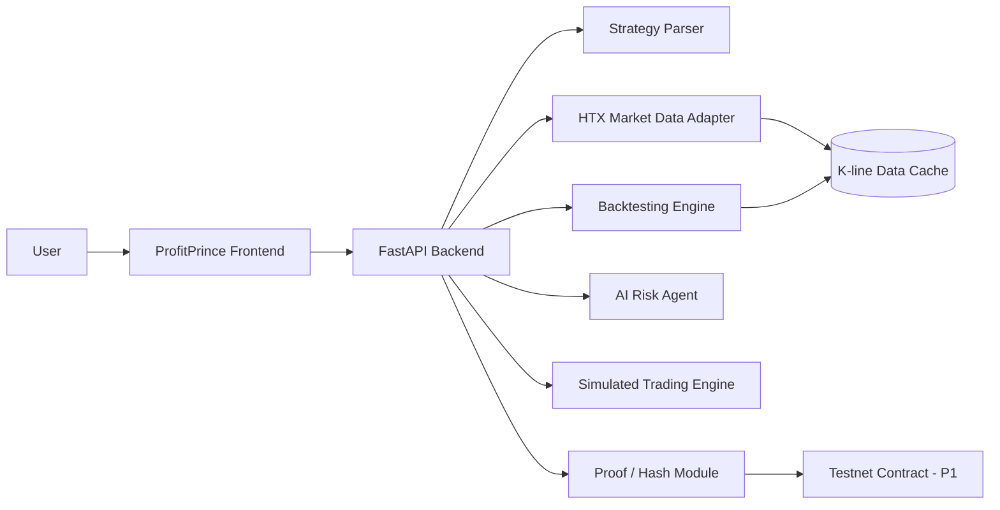

# ProfitPrince

## AI Self-Evolving Trading Strategy Agent for HTX

ProfitPrince 是一个面向 HTX 生态交易用户的 AI 自进化交易策略 Agent。用户可以用自然语言描述交易想法，系统将其解析为结构化策略，基于 HTX 行情数据进行历史回测，由 AI 解释风险并给出优化建议，再通过模拟交易执行策略，并将策略版本、回测结果与执行日志生成可验证 hash。

本项目不承诺收益，不提供稳赚策略，不做黑箱喊单。ProfitPrince 的目标是帮助用户把交易想法转化为可验证、可风控、可迭代的策略工作流。

---

## Hackathon Information

| Item | Content |
| --- | --- |
| Project | ProfitPrince |
| Chinese Name | 盈利小王子 |
| Track | HTX Genesis Hackathon · AI × Web3 / Genesis |
| Positioning | AI 策略生成 + HTX 行情/交易接入 + 回测风控 + 链上存证 |
| Target Awards | Top 40, Best AI + Web3 Integration, Best Product Experience |
| Demo Scope | Natural language strategy generation, backtesting, risk explanation, simulated execution, verifiable proof |
| Version | V1.0 |
| Date | 2026-06-16 |

---

## One-Liner

ProfitPrince turns natural-language trading ideas into backtested, risk-aware, simulated, and verifiable strategy workflows for the HTX ecosystem.

---

## Problem

Many crypto trading users can describe a strategy in plain language, but they cannot easily:

- Convert the idea into executable strategy rules.
- Validate the idea against historical market data.
- Understand drawdown, risk exposure, position sizing, and failure cases.
- Simulate an order lifecycle before touching real funds.
- Prove that a strategy version, backtest result, or execution log has not been modified.

Traditional quant tools are powerful but difficult for non-technical users. General AI chat tools can explain ideas, but they usually do not provide an end-to-end workflow from strategy generation to backtesting, execution simulation, and verifiable records.

ProfitPrince closes this gap for HTX users.

---

## Solution

ProfitPrince provides a complete AI-assisted strategy workflow:

1. User describes a trading idea in natural language.
2. AI parses the idea into a structured strategy JSON / DSL.
3. The system loads HTX market data for supported trading pairs.
4. The backtesting engine calculates return, win rate, max drawdown, trade count, and equity curve.
5. The AI risk agent explains where the strategy works, where it fails, and how parameters can be improved.
6. The simulated execution engine creates mock orders, positions, take-profit / stop-loss events, and logs.
7. The proof module generates hashes for the strategy, backtest, and execution logs.

This creates a workflow that is understandable to retail users, credible to technical judges, and extensible for the HTX ecosystem.

---

## Demo Flow

The MVP demo is designed to run in 3-5 minutes:

| Step | User Action | System Output |
| --- | --- | --- |
| 1 | Select HTX pair and risk preference | BTC/USDT or ETH/USDT market context |
| 2 | Enter natural-language strategy | Structured strategy JSON and explanation |
| 3 | Run backtest | Return, win rate, max drawdown, trade count, equity curve |
| 4 | Review AI risk analysis | Risk score, failure conditions, parameter suggestions |
| 5 | Start simulated trading | Mock orders, position state, take-profit / stop-loss lifecycle |
| 6 | Generate proof | Strategy hash, backtest hash, execution log hash |

Example user input:

```text
Use 1000 USDT on BTC/USDT. Buy when BTC drops 5%, take profit at 10%, stop loss at 3%, and keep max drawdown under 5%.
```

Example structured strategy output:

```json
{
  "symbol": "BTC/USDT",
  "timeframe": "1h",
  "capital": 1000,
  "entry": {
    "type": "price_drop",
    "dropPercent": 5
  },
  "exit": {
    "takeProfitPercent": 10,
    "stopLossPercent": 3
  },
  "risk": {
    "maxDrawdownPercent": 5,
    "positionSizePercent": 30,
    "riskLevel": "medium"
  }
}
```

---

## Core Features

### 1. Natural Language Strategy Generation

Users can describe strategy ideas without writing code. The AI parser converts these inputs into structured strategy rules.

Supported parameters in the MVP:

- Trading pair, such as BTC/USDT and ETH/USDT.
- Timeframe, such as 1m, 5m, 1h, 4h, and 1d.
- Entry condition, such as price drop percentage.
- Exit conditions, including take-profit and stop-loss.
- Position sizing.
- Risk preference and max drawdown threshold.

The system avoids generating or displaying guaranteed-profit language.

### 2. HTX Market Data Adapter

The market module is designed to connect to HTX market data for major trading pairs.

MVP requirements:

- Support BTC/USDT and ETH/USDT.
- Support historical K-line data for backtesting.
- Support realtime or near-realtime price display.
- Use a last-successful HTX-compatible K-line snapshot when the live API is unavailable.
- Use bundled local sample data only when no live or cached snapshot exists.
- Clearly label the data source in the UI.

### 3. Backtesting Engine

The backtesting engine validates a generated strategy against historical K-line data.

MVP strategy template:

- Buy after a configured price drop.
- Take profit at a configured percentage.
- Stop loss at a configured percentage.
- Apply position sizing and fee assumptions.

Backtest output:

- Total return.
- Win rate.
- Maximum drawdown.
- Trade count.
- Profit / loss ratio.
- Equity curve.
- Trade details.

The backtest result must be reproducible from the input strategy and market data. It should not rely on fixed or hardcoded win-rate numbers.

### 4. AI Risk Explanation Agent

The risk agent explains the strategy in plain language:

- Suitable market conditions.
- Unsuitable market conditions.
- Main risk factors.
- Position sizing concerns.
- Drawdown warnings.
- Suggested parameter improvements.

If the backtest exceeds the user-defined risk threshold, the AI should recommend reducing position size, tightening stop loss, changing entry conditions, or avoiding execution.

### 5. Simulated Trading Execution

The MVP uses simulated execution by default. It does not custody user funds and does not perform real-money trading.

The simulation module supports:

- Mock order creation.
- Mock fills.
- Position state.
- Take-profit trigger.
- Stop-loss trigger.
- Manual stop.
- Execution logs.

This keeps the demo safe while preserving a realistic execution workflow.

### 6. Strategy Dashboard

The dashboard presents strategy performance and state in a format that judges can understand quickly.

Key panels:

- Strategy card.
- HTX trading pair and market state.
- Equity curve.
- Return, win rate, drawdown, and trade count.
- Risk level.
- Strategy version history.
- Simulated order log.
- Strategy / backtest / execution hashes.

### 7. Web3 Proof Module

The proof module generates hashes for:

- Strategy JSON.
- Backtest result.
- Simulated execution log.

MVP can display local hashes and simulated on-chain records. The P1 version can write these hashes to a testnet smart contract.

The purpose is to prove that a strategy version, backtest result, and execution log are traceable and tamper-evident.

---

## AI × Web3 × HTX Fit

### AI

ProfitPrince uses AI to:

- Parse natural-language trading ideas.
- Generate structured strategies.
- Explain strategy risks.
- Suggest parameter improvements.
- Present backtest results in user-friendly language.

### Web3

ProfitPrince uses Web3 concepts to:

- Create verifiable records of strategy versions.
- Hash backtest outputs.
- Hash execution logs.
- Prepare for testnet-based strategy proof.
- Support future strategy marketplace and creator reputation.

### HTX Ecosystem

ProfitPrince is designed around HTX trading scenarios:

- HTX trading pairs such as BTC/USDT and ETH/USDT.
- HTX market data integration.
- Future HTX trading API authorization.
- Strategy templates for HTX active traders.
- Potential $HTX utility for advanced strategies, subscriptions, publishing, and governance.

---

## Architecture

Recommended MVP architecture:



Frontend:

- Single-page ProfitPrince terminal interface.
- Strategy input and generated JSON display.
- K-line and equity curve visualization.
- Dashboard, order log, and proof panel.
- Demo Mode for stable presentation.

Backend:

- Python FastAPI service.
- Strategy parser.
- HTX market adapter.
- Backtesting engine.
- Risk explanation module.
- Simulated trading module.
- Hash / proof service.

Web3:

- MVP: local hash and simulated chain record.
- P1: testnet smart contract for strategy, backtest, and execution log hashes.

---

## API Design

| Method | Endpoint | Input | Output |
| --- | --- | --- | --- |
| POST | `/api/strategy/parse` | Natural-language input, risk preference, symbol | Strategy JSON, explanation, risk tags |
| GET | `/api/market/klines` | Symbol, timeframe, limit | K-line array, data source, updated time |
| POST | `/api/backtest/run` | Strategy JSON, fee config, market data | Return, win rate, drawdown, trades, equity curve |
| POST | `/api/risk/explain` | Strategy JSON, backtest result, market state | Risk score, explanation, optimization suggestions |
| POST | `/api/trade/simulate` | Strategy JSON, market state, capital config | Mock orders, position, execution logs |
| POST | `/api/proof/hash` | Strategy, backtest, execution logs | Hashes, version number, optional tx hash |

---

## MVP Scope

### P0: Required for Demo

- Functional ProfitPrince frontend prototype.
- HTX market data adapter with cached snapshot and local K-line fallback.
- Natural-language strategy parser.
- Basic backtesting engine.
- AI risk explanation.
- Simulated trading lifecycle.
- Strategy performance dashboard.
- Hash generation for strategy, backtest, and execution logs.

### P1: Strong Follow-Up

- Testnet smart contract for proof storage.
- HTX trading API wrapper with authorization flow.
- Strategy version history and AI parameter iteration.
- $HTX-based strategy marketplace design.
- Creator strategy publishing and subscription mechanism.

### P2: Future Expansion

- ZK-based verifiable execution proof.
- On-chain liquidity and wallet-flow signals.
- Prediction market signals.
- DAO treasury strategy governance.
- Multi-agent strategy research workflow.

---

## Roadmap

| Stage | Tasks | Deliverables |
| --- | --- | --- |
| D1 | Product positioning, PRD, demo story, frontend issue fixes | Runnable frontend and confirmed MVP scope |
| D2-D3 | Backend skeleton, strategy JSON, market data adapter, fallback data | Frontend-backend integration |
| D4-D5 | Backtesting engine, equity curve, risk explanation, strategy versions | Natural language to backtest loop |
| D6 | Simulated trading, logs, dashboard, proof hashes | Complete MVP demo loop |
| D7 | README, deployment docs, pitch deck, demo video | Submission-ready package |

---

## Team Roles

| Member | Role | Responsibilities |
| --- | --- | --- |
| Product / Pitch Lead | Product, business, and presentation | Positioning, PRD, business model, pitch story, demo script |
| Trading Engine Lead | Trading system and execution | Auto-trading framework, exchange API adapter, simulated trading flow |
| Backend / Web3 / ZK Lead | Backend and proof layer | API architecture, proof module, strategy versions, ZK research |
| Strategy / QA Lead | Strategy and testing | Trading rules, backtest validation, risk rules, test cases |
| Backend / Infra Lead | Infrastructure | API service, database, deployment, logs, system stability |

---

## Business Potential

ProfitPrince can expand into several product directions:

- Subscription-based advanced strategy tools.
- Strategy marketplace for KOLs and trading communities.
- HTX-focused trading assistant for active users.
- Risk-control tooling for small funds and DAO treasuries.
- B2B strategy validation and audit service.

Potential $HTX utility:

- Unlock advanced strategy templates.
- Publish strategies to a marketplace.
- Subscribe to creator strategies.
- Participate in strategy ranking or governance.
- Receive ecosystem incentives for verified strategy contributions.

---

## Compliance and Safety Boundary

ProfitPrince is designed as a strategy research, backtesting, risk explanation, and simulated execution tool.

The project avoids:

- Guaranteed-profit claims.
- "Always win" or "risk-free" language.
- Unverifiable win-rate claims.
- Black-box trading signals without explanation.
- Real-money custody in the MVP.

Recommended public wording:

- AI-assisted strategy workflow.
- Backtest validation.
- Risk-aware simulation.
- Verifiable strategy record.
- HTX ecosystem trading strategy agent.

---

## Local Run

Install backend dependencies:

```bash
cd backend
python3 -m pip install -e '.[dev]'
```

Run backend tests:

```bash
python3 -m pytest
```

Start the API:

```bash
python3 -m uvicorn app.main:app --reload --host 127.0.0.1 --port 8000
```

Start the frontend from another terminal:

```bash
cd frontend
python3 -m http.server 5173
```

Open:

```text
http://127.0.0.1:5173
```

The frontend defaults to `http://127.0.0.1:8000` for the API.

---

## 3-5 Minute Pitch Script

| Time | Section | Message |
| --- | --- | --- |
| 0:00-0:30 | Problem | Many traders have ideas but cannot code, backtest, or control risk. |
| 0:30-1:10 | AI Strategy Generation | ProfitPrince converts plain language into a structured strategy. |
| 1:10-2:00 | Backtesting | The strategy is tested on HTX market data with return, win rate, drawdown, and equity curve. |
| 2:00-2:50 | Simulated Execution | The user starts a simulated HTX trading workflow with orders, positions, and logs. |
| 2:50-3:40 | Web3 Proof | Strategy, backtest, and execution logs are hashed for traceability. |
| 3:40-4:30 | Ecosystem and Business | ProfitPrince can grow into an HTX-native strategy marketplace and risk-control layer. |

---

## Submission Checklist

- [x] GitHub repository with source code.
- [x] Runnable frontend demo.
- [x] Backend API service.
- [x] Demo Mode with stable sample strategy and market data.
- [x] README and deployment instructions.
- [ ] Demo video.
- [ ] Pitch deck within 15 pages.
- [x] PRD / project documentation.
- [x] Clear HTX integration explanation.
- [x] Clear AI and Web3 contribution explanation.
- [x] Compliance-safe wording with no guaranteed-return claims.

---

## Final Summary

ProfitPrince transforms from a visual trading terminal into an HTX-native AI strategy agent. The MVP focuses on one credible loop: natural-language strategy input, AI parsing, HTX market backtesting, risk explanation, simulated execution, and verifiable proof.

This direction is technically demonstrable, product-friendly, safer from a compliance perspective, and strongly aligned with the HTX Genesis Hackathon scoring criteria.
